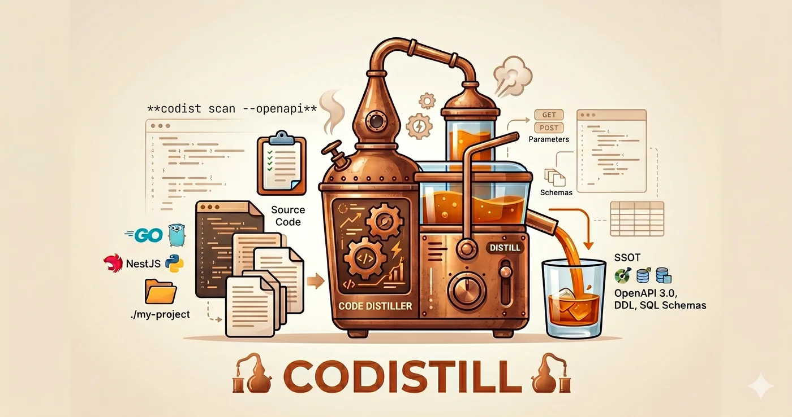

# codistill

<p align="center">
  
</p>

[](https://github.com/park-jun-woo/codistill/releases)
[](LICENSE)
[](https://skills.sh/park-jun-woo/codistill)

**Stop writing API specs by hand.** codist reads your web framework source code and extracts OpenAPI specs, DDL schemas, and SQL query skeletons — automatically.

- OpenAPI 3.0 spec from source code in seconds, not hours
- Merge with existing openapi.yaml — router registration is ground truth
- DDL migrations merged into clean per-table snapshots (ALTER COLUMN supported)
- sqlc query scaffolding with ratchet workflow
- Zero runtime overhead — pure static analysis, no instrumentation

## Quickstart

```bash
npx skills add park-jun-woo/codistill
```

Or install the CLI directly (requires [Go](https://go.dev/dl/)):

```bash
git clone https://github.com/park-jun-woo/codistill.git
cd codistill && make install
```

Then scan your project:

```bash
codist scan --openapi ./my-project
```

## Supported Frameworks

| Framework | Language | Status |
|---|---|---|
| **Go + Gin** | Go | Stable — `go/ast` + `go/types`, oapi-codegen `.gen.go` supported |
| **Fiber** | Go | Stable — tree-sitter, `fiber.New()` + `app.Get()` routing |
| **Echo** | Go | Stable — tree-sitter, `echo.New()` + `e.GET()` routing |
| **NestJS** | TypeScript | Stable — tree-sitter, decorator-based extraction |
| **Fastify** | TypeScript | Stable — tree-sitter, `fastify.get()` + schema-based validation |
| **Hono** | TypeScript | Stable — tree-sitter, `app.get()` routing with middleware |
| **FastAPI** | Python | Stable — tree-sitter, Pydantic model extraction |
| **Flask** | Python | Stable — tree-sitter, `@app.route()` decorator extraction |
| **Django** | Python | Stable — tree-sitter, `urlpatterns` + `ViewSet` extraction |
| **Express** | TypeScript | Stable — tree-sitter, function-call routing, cross-file router mount |
| **Spring Boot** | Java | Stable — tree-sitter, annotation-based extraction |
| **Quarkus** | Java | Stable — tree-sitter, JAX-RS annotation extraction |
| **ASP.NET Core** | C# | Stable — tree-sitter, `[HttpGet]`/`[Route]` attribute extraction |
| **Supabase Edge Functions** | Deno TypeScript | Stable — file-system routing, `serve()`/`Deno.serve()` extraction |
| **Actix Web** | Rust | Stable — tree-sitter, `#[get]`/`web::resource()` macro extraction |
| **Laravel** | PHP | Stable — tree-sitter, `Route::get()` + resource controller extraction |

Framework is auto-detected from `go.mod`, `package.json`, `requirements.txt`, `pom.xml`/`build.gradle`, `*.csproj`, `Cargo.toml`, `composer.json`, or `supabase/functions/`. Override with `--framework`:

```bash
codist scan --framework gogin ./project
codist scan --framework fiber ./project
codist scan --framework echo ./project
codist scan --framework nestjs ./project
codist scan --framework fastify ./project
codist scan --framework hono ./project
codist scan --framework fastapi ./project
codist scan --framework flask ./project
codist scan --framework django ./project
codist scan --framework express ./project
codist scan --framework spring ./project
codist scan --framework quarkus ./project
codist scan --framework dotnet ./project
codist scan --framework supafunc ./project
codist scan --framework actix ./project
codist scan --framework laravel ./project
```

## Usage

### Extract OpenAPI 3.0

```bash
codist scan --openapi ./my-project
codist scan --openapi -o api.yaml ./my-project
```

If the project already has an `openapi.yaml`, codist auto-detects and merges — structure from code, descriptions from existing spec. Dead specs (not registered in router) are dropped.

```bash
# Explicit base spec
codist scan --openapi --base existing-openapi.yaml ./my-project
```

### Extract endpoint index (YAML/JSON)

```bash
codist scan ./my-project
codist scan --json ./my-project
```

### Parse DDL migrations

```bash
codist ddl ./migrations -o ./schema
```

Supports CREATE/DROP TABLE, ADD/DROP COLUMN, ALTER COLUMN (SET/DROP NOT NULL, SET/DROP DEFAULT, TYPE), ADD/DROP CONSTRAINT, CREATE/DROP INDEX.

### SQL query scaffolding (ratchet workflow)

```bash
codist sql next --repo ./repository --queries ./db/query
codist sql status
```

## What it extracts

| Layer | Output |
|---|---|
| Routes | HTTP method, path, handler location, middleware |
| Request | Body binding type + struct fields, query/form/path params, file uploads |
| Response | Status codes, body types + struct fields, `json`/`validate` tags |
| OpenAPI | Paths, parameters, requestBody, responses, components/schemas |
| DDL | Per-table CREATE TABLE snapshots from migration history (ALTER COLUMN supported) |
| SQL | Repository method skeletons with CRUD type, tables, params, returns |

## Flags

```
codist scan [flags] [project-root]

  --openapi       Output OpenAPI 3.0 YAML
  --json          Output JSON
  --framework     Framework override (gogin, fiber, echo, nestjs, fastify, hono, fastapi, flask, django, express, spring, quarkus, dotnet, supafunc, actix, laravel)
  --base string   Base OpenAPI spec to merge with
  -o string       Write to file instead of stdout

codist ddl [flags] [migrations-dir]

  -o string   Output directory (one .sql file per table)

codist sql [flags] [repository-dir]

  --json      Output JSON (default YAML)
  -o string   Output file path
```

## Changelog

### v0.1.11

**Scanner accuracy fixes from real-world repos.** Validated codist against 7 large open-source projects (Immich, Ghost, Wiki.js, NocoDB, Plane, AppFlowy, Medusa) and fixed 12 extraction defects the synthetic test fixtures never exercised. `go test ./...` green, `filefunc validate` clean, function-level test status (tsma) at 100%.

- **NestJS** — `@Controller(Enum.X)` member-expression paths now resolved (Immich `RouteKey.*` no longer leaks into paths); `@Get(['/a','/b'])` array-path decorators fan out to one endpoint per path (NocoDB 90→553); a comment between decorator and method no longer drops the route; nested DTO/enum schemas are recursively registered and `$ref`/schema casing is preserved (no more `xxxDto[]` pseudo-schemas); scanning a path that already ends in `src/` no longer silently yields 0 (now warns / falls back).
- **Express** — the usage-fallback router heuristic no longer mistakes `req.get()`/`config.get()`/`model.get()` for routes (Ghost false positives −53%); auth middleware is matched by substring so `authAdminApi`-style guards register security; `res.render`/`res.redirect` and method-default status codes (POST→201, DELETE→204) are inferred; cross-file same-path routes under different mounts are no longer dedup-collapsed.
- **Django** — custom intermediate base classes (`BaseViewSet`→`ModelViewSet`, `BaseAPIView`→`APIView`) are resolved transitively; `as_view({"get":"list",...})` method dicts are honored instead of single-GET fallback (Plane write-methods 7→219); package `__init__.py` star-import URL aggregation is followed so `include()` prefixes compose correctly.
- **Actix (Rust)** — `fn() -> Scope` indirect builder registration (`App.service(workspace_scope())`) is resolved across files with scope-prefix synthesis (AppFlowy 1→185 routes).

### v0.1.10

**Function-level test coverage sweep.** Drove every function in the codebase to a measured test status (TestMaster `tsma`): all 1729 functions resolved (PASS at 100% branch coverage, or best-effort DONE where branches are unreachable in isolated unit tests — e.g. `golang.org/x/tools/go/packages.Load` paths needing framework deps not in `go.mod`). Coverage average ~91%, `go test ./...` green.

- **Tests only** — no production behavior changed; the sweep added/strengthened `*_test.go` across all scanner backends (actix, django, express, fastapi, fastify, flask, fiber, gogin, hono, nestjs, quarkus, spring, laravel, dotnet, echo, zod, supafunc) and `internal/ddl`.
- **Bug fix (BUG-001 / Phase130)** — `internal/scanner/echo` `resolveCallTarget` now guards `info == nil` (returns `token.NoPos`), matching its sibling resolvers; closes a latent nil-pointer dereference surfaced by the coverage sweep.

### v0.1.9

**Generated DDL is now executable** (verified against a live PostgreSQL 16 + pgvector). Driven by reproducing a real Prisma-backed stack (Express + TypeScript + Prisma, multi-tenant composite FKs, pgvector embeddings, enums).

- **Prisma enums** → `CREATE TYPE … AS ENUM (…)` emitted before the tables that use them; enum-valued defaults are quoted (`DEFAULT 'USER'`).
- **Identifier quoting** — every table/column/enum-type/FK identifier is double-quoted like Prisma does, so reserved-word models (`User`, `Order`) no longer fail with a syntax error and mixed-case names (`orgId`) are preserved instead of folded to lowercase.
- **FK-aware table ordering** — tables are topologically sorted (referenced tables first) and per-table files get fixed-width numeric prefixes (`00_enums.sql`, `01_…`), so applying them in order satisfies foreign keys. Cycles fall back to a deterministic order with a warning.

**Richer OpenAPI from Express scans:**

- **Response status codes** are emitted as strings (`"200"`) per the OpenAPI 3.0 spec.
- **requestBody from validation schemas** — cross-file Joi schemas (`validate(authValidation.register)`), barrel re-exports (`export { default as x } from './x'`), and validators on chained routes (`router.route().post(validate(...), …)`) are now resolved into `requestBody`/parameters. Works whether the validator is the first argument or follows other middleware, for both Joi and zod.
- **Security** — `auth(...)` middleware is recognized so protected routes emit `security: [{ bearerAuth: [] }]` with a `bearerAuth` security scheme; public routes stay open.

Internal: new `internal/scanner/joi` parser; `internal/prisma`/`internal/ddl` extended; one-file-one-function convention (`filefunc validate` clean); full `go test ./...` green.

### v0.1.8

**CLI migrated to cobra/pflag.** The command layer was rebuilt on `spf13/cobra`, replacing the hand-rolled `flag` dispatch.

- **Flag position bug fixed** — the standard library `flag` package stops parsing at the first non-flag argument, so `codist scan <path> --openapi -o out.yaml` silently dropped the trailing flags (plain YAML went to stdout, no file written, no error). pflag parses flags and positionals interspersed, so flags now work in any position.
- Subcommands (`scan`/`ddl`/`prisma`/`sql` + `sql next|status|list|skip|reset`/`version`) are a native cobra command tree with auto-generated help; the manual usage text and `sql` sub-dispatch were removed.
- **CLI surface change** — single-dash long flags (`-framework`) are no longer accepted (pflag treats them as shorthand groups); use `--framework`. Short flags like `-o` are unchanged.

Internal: command builders follow the one-file-one-function convention (`filefunc validate` clean); full `go test ./...` green.

### v0.1.7

**Prisma schema support** (`codist prisma`) — a new subcommand parses `schema.prisma` directly into DDL tables, reusing the `ddl` renderer. For Prisma-backed projects whose DB source-of-truth is the schema file (not raw SQL migrations), the full data model is now extractable.

- `model` → `CREATE TABLE` (with `@@map`/`@map` table & column name overrides).
- Scalar vs relation field detection — navigation fields are excluded; `@relation(fields:[...], references:[...])` becomes a `FOREIGN KEY`, including **composite FKs** (e.g. multi-tenant `(entity_id, org_id)` isolation).
- Type mapping — Prisma scalars → SQL (`DateTime`→`timestamp(3)`, `Json`→`jsonb`, …), `@db.*` native types take precedence, and `Unsupported("vector(768)")` is preserved verbatim (**pgvector**/PostGIS).
- Constraints — field `@id`/`@@id` (composite PK), `@unique`/`@@unique` (composite UNIQUE), `@@index`, `@default(autoincrement())`→`serial`, `onDelete`/`onUpdate`.
- Single `schema.prisma` or a `prisma/schema/` directory (multi-file) accepted.

**Express JavaScript support** — the Express scanner now collects `.js`/`.jsx`/`.mjs`/`.cjs` (not just `.ts`). Pure-JS Express projects that previously scanned to 0 endpoints (e.g. `node-express-boilerplate`) now extract correctly, with CommonJS `require()` mount-prefix resolution restored. Extension assumptions unified into a single source list.

Internal: new `internal/prisma` package and refactored Express resolver follow the one-file-one-function convention (`filefunc validate` clean); full `go test ./...` green.

### v0.1.6

**Path/route accuracy across frameworks** (the big one — paths were the #1 correctness problem). Validated by re-scanning real-world apps; e.g. Flask `flasky` now emits `/auth/login`, `/api/v1/posts/{id}/comments/` instead of the bare, prefix-stripped `/login`, `/posts/`.

- **Django** — pure `urlpatterns` support: `path()`/`re_path()`, `include()` recursive mounting with prefix composition, function/CBV (`as_view()`) views, `i18n_patterns()` unwrapping. Previously only DRF routers were recognized (router-less apps scanned to 0 endpoints).
- **Flask** — cross-file `register_blueprint(bp, url_prefix=...)` composition, including import-alias resolution. Blueprint-prefixed paths are no longer dropped.
- **Hono** — `.tsx` files scanned; `OpenAPIHono` + `app.openapi(createRoute({method,path}))` recognized; cross-file `app.route('/prefix', subApp)` mounts composed via per-`(file, var)` prefix keys.
- **Echo** — non-literal path args (`e.GET(config.X, h)`) resolved via `go/types`; group-prefix const args resolved; echo v4 **and** v5 import paths recognized; `*` wildcard normalized to `{wildcard}`.
- **Fastify** — `register(plugin, {prefix})` (incl. async wrapper) and `@fastify/autoload` directory prefixes composed.
- **Laravel** — fixed malformed `apiResource` path params (`{/product}` → `{product}`), group `prefix` now applied to nested `apiResource`, `routes/api.php` `/api` prefix, chained route handling.
- **ASP.NET Core** — method-level `[Route("seg")]`/`[HttpGet("seg")]` segments composed onto the controller base path (actions no longer collapse to one path); `{version:apiVersion}` token normalized.
- **Actix** — multi-line `web::resource().route()` chains, inline-closure handlers, and method-less `.to()` (ANY) resources now detected.
- Scan hygiene — `tests/`/`__tests__`/`*.test.*` fixtures excluded; duplicate endpoints de-duplicated. Path templates/wildcards normalized; `operationId` doubling removed.

**Request body schemas** — fiber `c.Bind().Body()`, Flask `request.form`/`request.json` fields, Fastify TypeBox, ASP.NET `[FromBody]` → `requestBody`.

**Response schemas** — a status-code + body-type model was added (Go `c.JSON`/`c.Status`, ASP.NET/Laravel envelopes). Still limited for frameworks that expose little declarative response info (e.g. Flask); richer response extraction is an ongoing follow-up.

Internal: scanner code refactored to the project's one-file-one-function convention (`filefunc validate` clean); full `go test ./...` green.

### v0.1.5

- **Express prefix resolution rewrite** — router instances are now keyed by `(file, varName)` instead of by file, so the same router mounted at multiple prefixes keeps every prefix and multiple routers in one file no longer collapse onto each other. Convergence loop bounded (no runaway).
- Deterministic scan output — `scanPass2` iterates parsed files in sorted order, `operationId` deduplication walks endpoints by index (not map order), and same method+path collisions resolve by a stable `(File, Line)` tie-break. Identical input now yields byte-identical specs across runs.
- Duplicate operation warning — `buildSpecNode` emits a stderr warning instead of silently overwriting when two endpoints collapse to the same path+method.
- **Bug fixes (from `go test ./...`)**:
  - Actix builder routes (`web::scope().service()...`) no longer recurse infinitely — chain traversal walks down the receiver chain instead of up through ancestors (previously hung/OOM'd).
  - Laravel `Route::middleware([...])->group()` routes are no longer double-collected by the flat collector, so group middleware (e.g. `auth:sanctum`) is preserved on the endpoint.
  - Laravel singularization keeps `-us` words intact (`status` no longer becomes `statu`).
- `go.sum` completeness — transitive test-dependency hashes (testify et al.) added so a fresh clone passes `go test`.

### v0.1.4

- **10 new framework scanners** — Flask, Fiber, Echo, Fastify, Hono, Quarkus, Django, ASP.NET Core, Laravel, Actix Web (total 16 frameworks)
- Flask (Python) — `@app.route()` decorator extraction, Blueprint support
- Fiber (Go) — `fiber.New()` + `app.Get()` routing, group prefix propagation
- Echo (Go) — `echo.New()` + `e.GET()` routing, group middleware
- Fastify (TypeScript) — `fastify.get()` routing, JSON Schema validation extraction
- Hono (TypeScript) — `app.get()` routing with middleware chain
- Quarkus (Java) — JAX-RS `@Path`/`@GET`/`@POST` annotation extraction
- Django (Python) — `urlpatterns` + `ViewSet` + `@api_view` extraction
- ASP.NET Core (C#) — `[HttpGet]`/`[Route]` attribute extraction, controller routing
- Laravel (PHP) — `Route::get()` + resource controller + Form Request validation
- Actix Web (Rust) — `#[get]`/`#[post]` macro routes + `web::resource().route()` builder pattern
- Express Zod body extraction — `validateRequest({ body: Schema })` middleware → request body schema
- Express response extraction — `res.status(N).json()` / `res.sendStatus(N)` → response status + kind
- Express security middleware mapping — `authenticate`/`authorize('admin')` → OpenAPI `security` + roles

### v0.1.3

- Express (TypeScript) scanner — `app.get()`/`router.post()` function-call routing extraction
- Cross-file router mounting with `app.use("/prefix", importedRouter)` prefix propagation
- Multi-level prefix chaining (convergence loop) for nested router mounts
- `router.route("/:id").get().put()` chain pattern with middleware extraction
- Named import `{ x }` / alias `{ x as y }` variable name extraction
- tsconfig `@/*` path alias resolution
- Function parameter router `(router: express.Router) => {}` recognition
- forEach dynamic router mount `routes.forEach(r => router.use(r.path, r.route))` extraction
- Supabase Edge Functions scanner — file-system routing from `supabase/functions/*/index.ts`
- `serve()`/`Deno.serve()` callback analysis with `req.method` branching
- Per-method body/response separation for multi-method Edge Functions
- `const { x } = await req.json()` destructuring + `body.field` dot-access extraction
- `searchParams.get("x")` query parameter extraction
- `new Response(..., { status: N })` status code extraction
- DDL Supabase compatibility — `*.sql` files, `/* */` block comments, `$$` dollar quoting, schema-qualified table names

### v0.1.2

- Spring Boot (Java) scanner — `@RestController`, `@GetMapping`/`@PostMapping`, `@RequestBody`, `@PathVariable`, `@RequestParam` extraction
- Spring DTO field extraction with Bean Validation (`@NotNull`, `@NotBlank`, `@Size`, `@Min`, `@Max`, `@Email`, `@JsonProperty`)
- Spring security annotation support (`@PreAuthorize`, `@Secured`, `@RolesAllowed`) → OpenAPI `security`
- Spring interface inheritance (API-First pattern) — `implements XxxApi` endpoint extraction
- `ResponseEntity.ok()`/`.status(N)` body analysis for accurate status codes
- Generic wrapper class field extraction (`PagedResponse<T>` → actual type substitution)
- Cross-package parent class inheritance for DTO fields
- Same-file inner class DTO resolution
- `static final` fields excluded from schemas (`serialVersionUID` etc.)
- `hasRole('A') or hasRole('B')` multi-role extraction
- Constant `defaultValue` resolution (`AppConstants.DEFAULT_PAGE_NUMBER` → `"0"`)
- `@RequestHeader` support (common model `Request.Headers` field added)
- Array `items` definition in DTO schemas (`List<T>` → proper `items` with `$ref`)
- `Endpoint.Roles` recognized as authenticated by `isAuthEndpoint()`

### v0.1.1

- OpenAPI `$ref` schema generation for named types (placeholder when fields unavailable)
- Unique `operationId` for inherited controllers (path prefix dedup)
- `required`/`enum`/`minLength`/`maxLength`/`minimum`/`maximum` constraints in OpenAPI
- `default: None` → `null` conversion for FastAPI query params
- NestJS generic type substitution in BaseController factory pattern
- OpenAPI `securitySchemes` + per-endpoint `security` from Guard/Depends
- `OmitType([...] as const)` array extraction fix
- `setGlobalPrefix` detection in non-main.ts files
- FastAPI `include_router(module.router)` attribute childVar support
- Primitive type inline schema (`bool` → `type: boolean`, not `$ref`)
- Pydantic/SQLModel inheritance field merging (parent → child)
- Multi-hop `include_router` prefix propagation with convergence loop
- DTO factory (`OmitType`/`PartialType`) optional/validate preservation
- `@Param()` keyless pattern → path template variable name extraction
- `@IsEnum(TaskStatus)` → cross-file enum member value extraction
- FastAPI `required` array from `hasDefault` + `Field(default=...)` analysis
- NestJS barrel `export * from` re-export DTO resolution
- Comma-separated `from ... import a, b, c` dotted_name parsing fix

### v0.1.0

- Initial release
- Go+Gin, NestJS, FastAPI endpoint extraction
- OpenAPI 3.0 spec generation with base spec merging
- DDL migration parsing (CREATE/ALTER/DROP TABLE)
- SQL query scaffolding with ratchet workflow

## License

MIT
