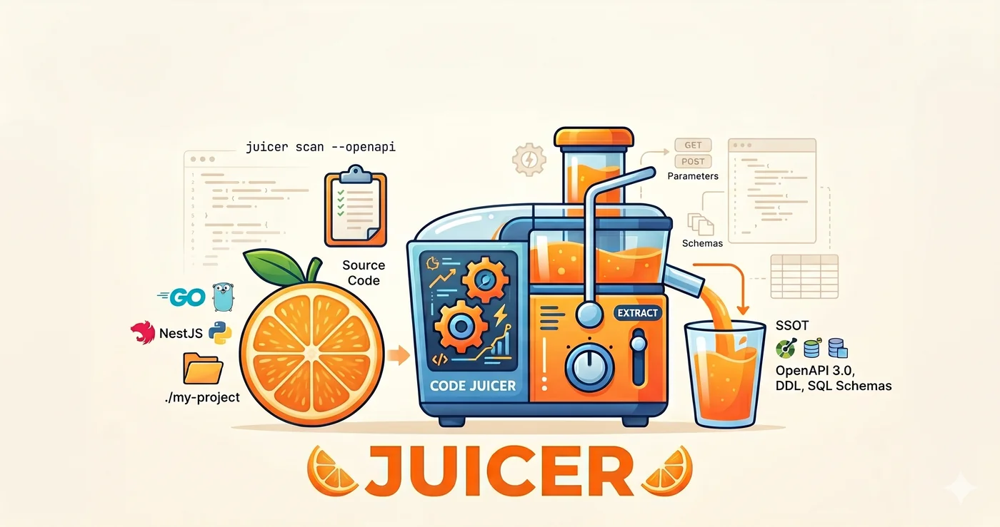

# juicer

<p align="center">
  
</p>

[](https://github.com/park-jun-woo/juicer/releases)
[](LICENSE)
[](https://skills.sh/park-jun-woo/juicer)

**Stop writing API specs by hand.** juicer reads your web framework source code and extracts OpenAPI specs, DDL schemas, and SQL query skeletons — automatically.

- OpenAPI 3.0 spec from source code in seconds, not hours
- Merge with existing openapi.yaml — router registration is ground truth
- DDL migrations merged into clean per-table snapshots (ALTER COLUMN supported)
- sqlc query scaffolding with ratchet workflow
- Zero runtime overhead — pure static analysis, no instrumentation

## Quickstart

```bash
npx skills add park-jun-woo/juicer
```

Or install the CLI directly:

```bash
go install github.com/park-jun-woo/juicer/cmd/juicer@latest
```

Then scan your project:

```bash
juicer scan --openapi ./my-project
```

## Supported Frameworks

| Framework | Language | Status |
|---|---|---|
| **Go + Gin** | Go | Stable — `go/ast` + `go/types`, oapi-codegen `.gen.go` supported |
| **NestJS** | TypeScript | Stable — tree-sitter, decorator-based extraction |
| **FastAPI** | Python | Stable — tree-sitter, Pydantic model extraction |

Framework is auto-detected from `go.mod`, `package.json`, or `requirements.txt`. Override with `--framework`:

```bash
juicer scan --framework gogin ./project
juicer scan --framework nestjs ./project
juicer scan --framework fastapi ./project
```

## Usage

### Extract OpenAPI 3.0

```bash
juicer scan --openapi ./my-project
juicer scan --openapi -o api.yaml ./my-project
```

If the project already has an `openapi.yaml`, juicer auto-detects and merges — structure from code, descriptions from existing spec. Dead specs (not registered in router) are dropped.

```bash
# Explicit base spec
juicer scan --openapi --base existing-openapi.yaml ./my-project
```

### Extract endpoint index (YAML/JSON)

```bash
juicer scan ./my-project
juicer scan --json ./my-project
```

### Parse DDL migrations

```bash
juicer ddl ./migrations -o ./schema
```

Supports CREATE/DROP TABLE, ADD/DROP COLUMN, ALTER COLUMN (SET/DROP NOT NULL, SET/DROP DEFAULT, TYPE), ADD/DROP CONSTRAINT, CREATE/DROP INDEX.

### SQL query scaffolding (ratchet workflow)

```bash
juicer sql next --repo ./repository --queries ./db/query
juicer sql status
```

## What it extracts

| Layer | Output |
|---|---|
| Routes | HTTP method, path, handler location, middleware |
| Request | Body binding type + struct fields, query/form/path params, file uploads |
| Response | Status codes, body types + struct fields, `json`/`validate` tags |
| OpenAPI | Paths, parameters, requestBody, responses, components/schemas |
| DDL | Per-table CREATE TABLE snapshots from migration history (ALTER COLUMN supported) |
| SQL | Repository method skeletons with CRUD type, tables, params, returns |

## Flags

```
juicer scan [flags] [project-root]

  --openapi       Output OpenAPI 3.0 YAML
  --json          Output JSON
  --framework     Framework override (gogin, nestjs, fastapi)
  --base string   Base OpenAPI spec to merge with
  -o string       Write to file instead of stdout

juicer ddl [flags] [migrations-dir]

  -o string   Output directory (one .sql file per table)

juicer sql [flags] [repository-dir]

  --json      Output JSON (default YAML)
  -o string   Output file path
```

## License

MIT
